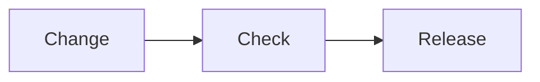

# Project documentation

A polished Astro Starlight starter for an open-source project's documentation. It ships with an English root site, matching Japanese routes, an optional Notes section, separate tag explorers for documentation and Notes, a configurable accent color, KaTeX equations, Mermaid diagrams, fast system fonts, and code blocks styled with Slack Ochin and Tokyo Night.

Use this README as the documentation setup guide after creating a project from the template.

## 1. Install and preview

Requirements:

- A current Node.js release supported by Astro
- [pnpm](https://pnpm.io/)

```sh
pnpm install
pnpm dev
```

The development server runs in the background at `http://localhost:4321` by default.

| Command | Purpose |
| --- | --- |
| `pnpm dev` | Start the development server in background mode |
| `pnpm dev:status` | Show the background server status |
| `pnpm dev:logs` | Read development server logs |
| `pnpm dev:stop` | Stop the background server |
| `pnpm build` | Build the production site and search index |
| `pnpm preview` | Preview the production build |

## 2. Set the project identity

Edit the `project` object at the top of `astro.config.mjs`:

```js
const project = {
  title: 'Project Docs',
  description: 'Clear, practical documentation for an open-source project.',
  repository: 'https://github.com/your-name/your-project',
  site: 'https://docs.example.com',
  features: {
    notes: true,
  },
};
```

Also update the Japanese title in the same file. The repository URL is used for the header's GitHub link and page edit links. The site URL is used for canonical metadata and the sitemap; replace the reserved `example.com` address before publishing.

Rename the package in `package.json`, and replace `public/favicon.svg` if the project has its own mark.

## 3. Choose a project color

Change one value near the top of `src/styles/theme.css`:

```css
:root {
  --project-accent-hue: 258;
}
```

Suggested hue values include `215` for blue, `258` for violet, `330` for pink, `160` for green, and `28` for orange. The file derives accessible light and dark accent roles from this value. Check contrast again if you also change saturation or lightness.

## 4. Write content in both languages

Starlight maps Markdown and MDX files in `src/content/docs/` to routes. English is served without a locale prefix; Japanese uses `/ja/`.

```text
src/content/docs/
├── index.mdx                         → /
├── guides/getting-started.md         → /guides/getting-started/
├── notes/index.mdx                   → /notes/
├── notes/tags.mdx                    → /notes/tags/
├── notes/welcome.md                  → /notes/welcome/
├── reference/configuration.md        → /reference/configuration/
├── tags.mdx                          → /tags/
└── ja/
    ├── index.mdx                     → /ja/
    ├── guides/getting-started.md     → /ja/guides/getting-started/
    ├── notes/index.mdx               → /ja/notes/
    ├── notes/tags.mdx                → /ja/notes/tags/
    ├── notes/welcome.md              → /ja/notes/welcome/
    ├── reference/configuration.md    → /ja/reference/configuration/
    └── tags.mdx                      → /ja/tags/
```

Create the English and Japanese files at matching relative paths so the language picker can connect them. English is the primary copy, but both versions should describe the same current behavior.

Start each page with frontmatter:

```yaml
---
title: Install the CLI
description: Install the CLI and verify the first command.
publishedAt: 2026-08-20
updatedAt: 2026-08-28
tags:
  - installation
  - cli
sidebar:
  order: 1
---
```

`publishedAt`, `updatedAt`, and `tags` are optional. Regular pages show the description below the title, followed by a small metadata row when dates or tags are provided. The row uses `updatedAt`, falling back to `publishedAt`, and shows up to three tags directly; four or more tags are collapsed behind a tag count. Splash pages omit the metadata row. Dates and tags are also retained in the page's HTML metadata. Use ISO dates and keep tag spellings consistent within each language.

Use `.md` for ordinary pages. Use `.mdx` when importing a Starlight component such as `Steps`, `Tabs`, or `TabItem`. The included content showcase demonstrates procedures, tabs, asides, equations, diagrams, tables, code titles, highlighted lines, and diffs.

Add a Mermaid diagram to either format with a fenced `mermaid` block:

````md

````

Diagrams use a modern layout derived from the project accent and switch automatically between light and dark colors. The Mermaid renderer is loaded only on pages that contain a diagram. Include `accTitle` and `accDescr` so the same idea remains available to people using assistive technology.

The included content showcase provides matching English and Japanese examples of a flowchart, sequence diagram, class diagram, and architecture diagram.

Write inline math between single dollar signs and display math between double dollar signs. Both Markdown and MDX pages render the notation with KaTeX at build time, so equations do not require client-side JavaScript.

```md
The energy equation is $E = mc^2$.

$$
\sum_{k=1}^{n} k = \frac{n(n+1)}{2}
$$
```

Escape a literal dollar sign as `\$` when it could otherwise be interpreted as math. See the content showcase for rendered inline and display examples.

## 5. Publish project Notes

Notes is a small blog-like section for dated project updates, decisions, experiments, and discoveries. Add English Markdown files to `src/content/docs/notes/` and matching Japanese files to `src/content/docs/ja/notes/`. The included landing pages introduce Notes and list entries by `publishedAt`, newest first. Notes stays out of the documentation sidebar.

Copy `notes/welcome.md` to a stable, descriptive filename in both language directories, then update its frontmatter and body. Add `updatedAt` when a published note changes meaning.

Documentation tags are searched at `/tags/` and `/ja/tags/`. Notes has independent tag explorers at `/notes/tags/` and `/ja/notes/tags/`, linked from each Notes landing page. The two scopes do not mix results.

The feature is controlled from the `project` object in `astro.config.mjs`:

```js
features: {
  notes: true,
},
```

Set `notes` to `false` to remove Notes header navigation, routes, tag explorer, and Pagefind entries from both development and production builds. The Markdown source remains available to restore later by setting the value back to `true`.

## 6. Shape the navigation

`astro.config.mjs` autogenerates only the Guides and Reference groups in the documentation sidebar and translates their labels for Japanese. Notes is intentionally available from the header instead of the sidebar. Add a new documentation section by adding a sidebar group and matching English/Japanese content directories.

On mobile, the docs, optional Notes, and tag links move into the navigation menu to leave room for the site title. Pages without a sidebar, including the homepage and tag explorer, provide a compact menu with the same links and theme and language controls.

The documentation tag explorers at `/tags/` and `/ja/tags/` exclude Notes. The Notes explorers at `/notes/tags/` and `/ja/notes/tags/` exclude guides and reference pages. Each explorer also stays within its language, so Japanese queries never return English fallback content. The regular Pagefind search index still covers both content types and keeps its language indexes separate.

Use stable, descriptive filenames. Moving a content file changes its public URL, so add an Astro redirect when preserving an old published route matters.

## 7. Adjust the visual system

- `src/styles/theme.css` contains project color tokens and neutral surfaces.
- `src/styles/site.css` contains English and Japanese typography, compact page metadata, consistent aside surfaces, navigation states, code-block and diagram finishing, responsive rules, and the landing page.
- `src/components/PageTitle.astro` renders the page description and optional date and tags. `PrimaryNavigation.astro` supplies the shared docs, optional Notes, and tag links used in desktop and mobile navigation.
- `src/components/NotesIndex.astro` renders each locale's Notes list in reverse chronological order. `TagExplorer.astro` keeps documentation and Notes tags in separate scopes.
- `astro.config.mjs` selects Slack Ochin for light code blocks and Tokyo Night for dark code blocks.

Both languages share the same local font stack: Inter Variable, Inter, system UI fonts, then Segoe UI Variable and Segoe UI. Japanese body text uses the browser and operating system's fallback. Blockquotes select Source Han Code JP's local upright faces for Japanese characters when installed, allowing synthesized italics because that family's italic faces leave Japanese glyphs upright. Other characters and systems without that font use the shared stack. Code has a separate monospace stack, starting with SFMono-Regular and Consolas. No font files are bundled or downloaded; installed fonts and browser settings determine the rendered faces.

Japanese headings use language-specific spacing and line height. For a short hero title, an optional `<wbr>` in `hero.title` marks a natural phrase boundary without forcing a line break on every screen size.

The desktop and mobile tables of contents include H2 through H4 in both languages. Adjust the heading range with Starlight's `tableOfContents` option in `astro.config.mjs`.

## 8. Validate before publishing

```sh
pnpm build
```

Confirm the build creates the English and Japanese versions of every page. For styling changes, also inspect desktop and mobile widths in light and dark modes, including keyboard focus, the current page in the left sidebar, the current heading in the right sidebar, and long code lines.

Production output is written to `dist/` and can be deployed to any static hosting provider.

## Project structure

```text
.
├── public/                 # Static files such as the favicon
├── src/
│   ├── components/        # Header metadata, navigation, Notes, and tag explorer UI
│   ├── content/docs/      # English and Japanese documentation
│   ├── plugins/           # Markdown transformations, including Mermaid fences
│   ├── scripts/           # Browser-side Mermaid rendering and theme syncing
│   ├── styles/            # Project theme and layout rules
│   └── content.config.ts  # Starlight collection and metadata schema
├── astro.config.mjs       # Project, locale, sidebar, and code settings
├── AGENTS.md              # Documentation rules for AI coding agents
├── LICENSE                # MIT license terms
└── package.json
```

For framework details, see the [Starlight documentation](https://starlight.astro.build/) and [Astro documentation](https://docs.astro.build/).

## License

This template is available under the [MIT License](./LICENSE).
