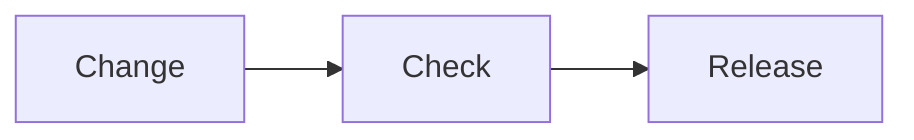

# Project documentation

A polished Astro Starlight starter for an open-source project's documentation. It ships with an English root site, matching Japanese routes, locale-specific tag search, a configurable accent color, Mermaid diagrams, fast system fonts, and code blocks styled with Slack Ochin and Tokyo Night.

Use this README as the documentation setup guide after creating a project from the template.

## 1. Install and preview

Requirements:

- A current Node.js release supported by Astro
- [pnpm](https://pnpm.io/)

```sh
pnpm install
pnpm dev
```

The development server runs in the background at `http://localhost:4321` by default.

| Command | Purpose |
| --- | --- |
| `pnpm dev` | Start the development server in background mode |
| `pnpm dev:status` | Show the background server status |
| `pnpm dev:logs` | Read development server logs |
| `pnpm dev:stop` | Stop the background server |
| `pnpm build` | Build the production site and search index |
| `pnpm preview` | Preview the production build |

## 2. Set the project identity

Edit the `project` object at the top of `astro.config.mjs`:

```js
const project = {
  title: 'Project Docs',
  description: 'Clear, practical documentation for an open-source project.',
  repository: 'https://github.com/your-name/your-project',
  site: 'https://docs.example.com',
};
```

Also update the Japanese title in the same file. The repository URL is used for the header's GitHub link and page edit links. The site URL is used for canonical metadata and the sitemap; replace the reserved `example.com` address before publishing.

Rename the package in `package.json`, and replace `public/favicon.svg` if the project has its own mark.

## 3. Choose a project color

Change one value near the top of `src/styles/theme.css`:

```css
:root {
  --project-accent-hue: 258;
}
```

Suggested hue values include `215` for blue, `258` for violet, `330` for pink, `160` for green, and `28` for orange. The file derives accessible light and dark accent roles from this value. Check contrast again if you also change saturation or lightness.

## 4. Write content in both languages

Starlight maps Markdown and MDX files in `src/content/docs/` to routes. English is served without a locale prefix; Japanese uses `/ja/`.

```text
src/content/docs/
├── index.mdx                         → /
├── guides/getting-started.md         → /guides/getting-started/
├── reference/configuration.md        → /reference/configuration/
├── tags.mdx                          → /tags/
└── ja/
    ├── index.mdx                     → /ja/
    ├── guides/getting-started.md     → /ja/guides/getting-started/
    ├── reference/configuration.md    → /ja/reference/configuration/
    └── tags.mdx                      → /ja/tags/
```

Create the English and Japanese files at matching relative paths so the language picker can connect them. English is the primary copy, but both versions should describe the same current behavior.

Start each page with frontmatter:

```yaml
---
title: Install the CLI
description: Install the CLI and verify the first command.
publishedAt: 2026-08-20
updatedAt: 2026-08-28
tags:
  - installation
  - cli
sidebar:
  order: 1
---
```

`publishedAt`, `updatedAt`, and `tags` are optional. They are stored as non-visible metadata and do not appear in the regular page layout. Use ISO dates and keep tag spellings consistent within each language.

Use `.md` for ordinary pages. Use `.mdx` when importing a Starlight component such as `Steps`, `Tabs`, or `TabItem`. The included content showcase demonstrates procedures, tabs, asides, tables, code titles, highlighted lines, and diffs.

Add a Mermaid diagram to either format with a fenced `mermaid` block:

````md

````

Diagrams use a modern layout derived from the project accent and switch automatically between light and dark colors. The Mermaid renderer is loaded only on pages that contain a diagram. Include `accTitle` and `accDescr` so the same idea remains available to people using assistive technology.

The included content showcase provides matching English and Japanese examples of a flowchart, sequence diagram, class diagram, and architecture diagram.

## 5. Shape the navigation

`astro.config.mjs` autogenerates the Guides and Reference groups from their directories and translates group labels for Japanese. The header adds direct links to the docs and tag explorer. Add a new top-level section by adding a sidebar group and matching English/Japanese content directories.

The tag explorer at `/tags/` searches only English entries. Its counterpart at `/ja/tags/` searches only Japanese entries, including localized title, description, and tag text. This strict collection split prevents a Japanese query from returning English fallback content. The regular Pagefind search index also receives tags as invisible filters and keeps its language indexes separate.

Use stable, descriptive filenames. Moving a content file changes its public URL, so add an Astro redirect when preserving an old published route matters.

## 6. Adjust the visual system

- `src/styles/theme.css` contains project color tokens and neutral surfaces.
- `src/styles/site.css` contains typography, content spacing, soft active navigation states, code-block and diagram finishing, responsive rules, and the landing page.
- `astro.config.mjs` selects Slack Ochin for light code blocks and Tokyo Night for dark code blocks.

The font stack uses local system fonts only, avoiding an extra network request and layout shift. Keep that default unless the project has an explicit typography requirement and can accept the performance cost.

## 7. Validate before publishing

```sh
pnpm build
```

Confirm the build creates the English and Japanese versions of every page. For styling changes, also inspect desktop and mobile widths in light and dark modes, including keyboard focus, the current page in the left sidebar, the current heading in the right sidebar, and long code lines.

Production output is written to `dist/` and can be deployed to any static hosting provider.

## Project structure

```text
.
├── public/                 # Static files such as the favicon
├── src/
│   ├── components/        # Header metadata, navigation, and tag explorer UI
│   ├── content/docs/      # English and Japanese documentation
│   ├── plugins/           # Markdown transformations, including Mermaid fences
│   ├── scripts/           # Browser-side Mermaid rendering and theme syncing
│   ├── styles/            # Project theme and layout rules
│   └── content.config.ts  # Starlight collection and metadata schema
├── astro.config.mjs       # Project, locale, sidebar, and code settings
├── AGENTS.md              # Documentation rules for AI coding agents
├── LICENSE                # MIT license terms
└── package.json
```

For framework details, see the [Starlight documentation](https://starlight.astro.build/) and [Astro documentation](https://docs.astro.build/).

## License

This template is available under the [MIT License](./LICENSE).
