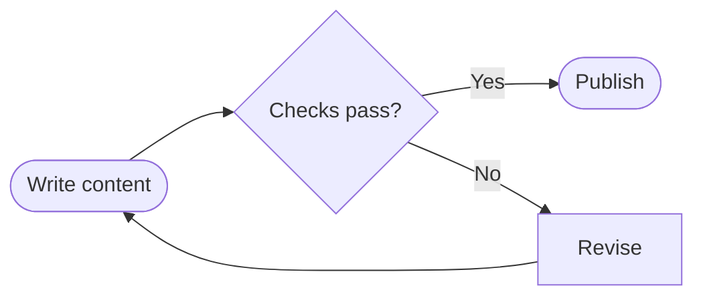
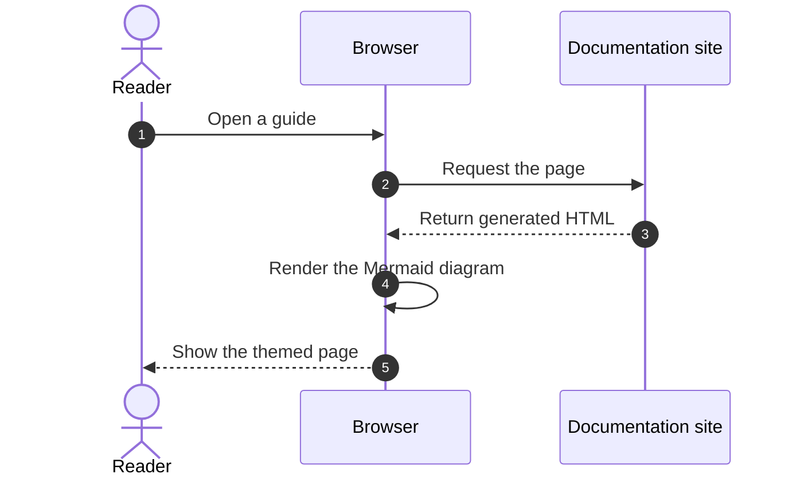
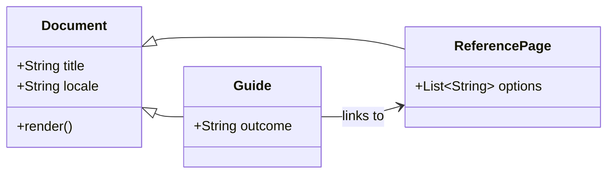
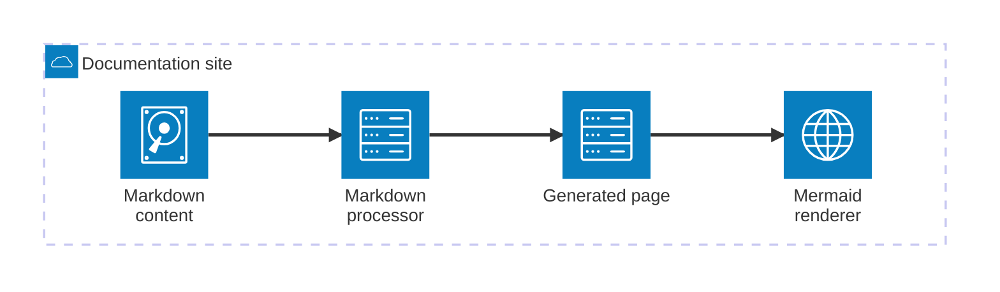

import { Steps, Tabs, TabItem } from '@astrojs/starlight/components';

Use this page as a visual regression check while changing the theme. It intentionally combines the content patterns that appear most often in project documentation.

## A focused procedure

<Steps>

1. Install the package.

   ```sh title="Terminal"
   pnpm add @acme/client
   ```

2. Create a client with an explicit endpoint.

   ```ts title="src/client.ts"
   import { createClient } from '@acme/client';

   export const client = createClient({
     endpoint: 'https://api.example.com',
   });
   ```

3. Run a health check and handle failures at the application boundary.

</Steps>

:::tip[Write for outcomes]
Start a guide with what the reader will accomplish. Move exhaustive option lists into a reference page.
:::

## Equivalent choices

Tabs are useful when readers need one of several equivalent commands. The selected package manager is remembered across pages.

<Tabs syncKey="package-manager">
  <TabItem label="pnpm" icon="seti:pnpm">
    ```sh
    pnpm add @acme/client
    ```
  </TabItem>
  <TabItem label="npm" icon="seti:npm">
    ```sh
    npm install @acme/client
    ```
  </TabItem>
  <TabItem label="Yarn" icon="seti:yarn">
    ```sh
    yarn add @acme/client
    ```
  </TabItem>
</Tabs>

## Write mathematical notation

Use single dollar signs for inline notation, such as $E = mc^2$. Put longer equations between double dollar signs so they have their own line:

$$
\sum_{k=1}^{n} k = \frac{n(n+1)}{2}
$$

Equations are rendered with KaTeX during the production build and remain readable by assistive technology without client-side JavaScript.

## Map a workflow

Use a `flowchart` for processes and relationships that are easier to scan as a diagram. Every Mermaid diagram uses a fenced `mermaid` block and automatically follows the site color theme.



## Trace an interaction

Use a `sequenceDiagram` when message order matters, such as a request moving between a reader, browser, and documentation site.



## Describe a type model

Use a `classDiagram` to show types, their important members, and the relationships between them without including implementation details.



## Show module relationships

Mermaid's `architecture-beta` diagram groups modules and shows how generated content moves between them. Use it for a small system overview rather than detailed request order.



## Highlighted code

The light theme uses **Slack Ochin** and the dark theme uses **Tokyo Night**. Filenames, focused lines, diffs, and copy controls are provided by Expressive Code.

```ts title="src/lib/fetch-release.ts" {7-11}
export interface Release {
  version: string;
  publishedAt: string;
}

export async function fetchLatestRelease(): Promise<Release> {
  const response = await fetch('/api/releases/latest');
  if (!response.ok) {
    throw new Error(`Release request failed: ${response.status}`);
  }
  return response.json() as Promise<Release>;
}
```

```diff title="Configuration change"
-const retries = 1;
+const retries = 3;
```

## Reference-friendly data

| Option | Type | Default | Purpose |
| --- | --- | --- | --- |
| `endpoint` | `string` | — | Base URL for every request. |
| `retries` | `number` | `3` | Retries transient failures. |
| `timeout` | `number` | `5000` | Stops stalled requests in milliseconds. |

:::caution[Keep examples honest]
Sample commands should be safe to copy. Clearly label placeholders, destructive operations, and required credentials.
:::

## Long-form reading

Good documentation keeps paragraphs compact without making every sentence its own block.

A comfortable line length and generous line height reduce the effort needed to move from one line to the next, while a restrained heading scale preserves hierarchy without overwhelming the page. Use this principle when deciding which details to keep:

> Prefer the shortest explanation that gives the reader enough context to make the next correct decision.

For example, an installation guide can explain the prerequisites, show the command, and describe how to confirm that it worked. Move less common options to a linked reference page so readers can finish the task without losing their place.

### Organize an installation guide

Split a longer guide into related tasks so readers can find where to begin and return to a step later. Keep supporting details under the task they belong to.

#### Check prerequisites

List supported operating systems and required tools before the installation steps. Link to setup instructions when readers may need to prepare their environment first.
