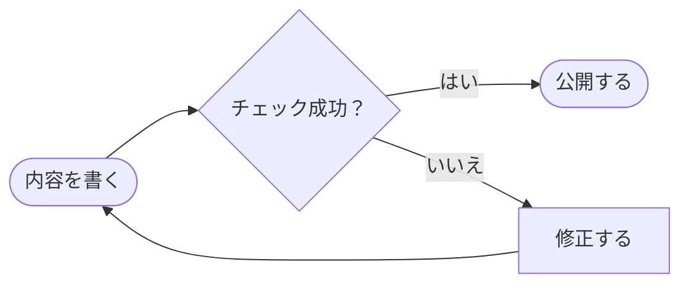
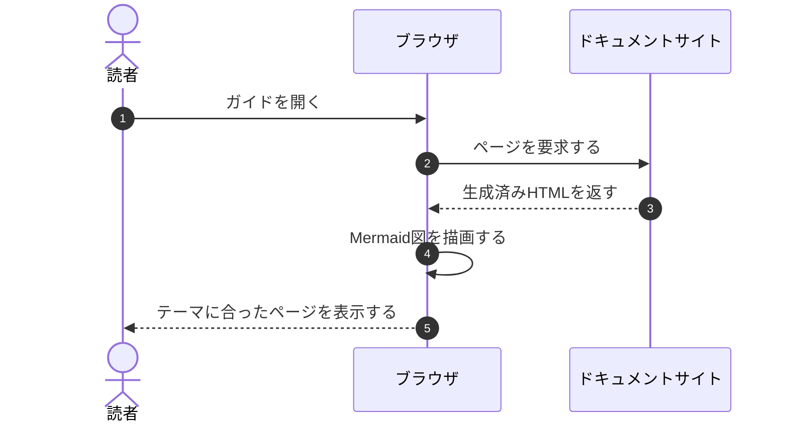
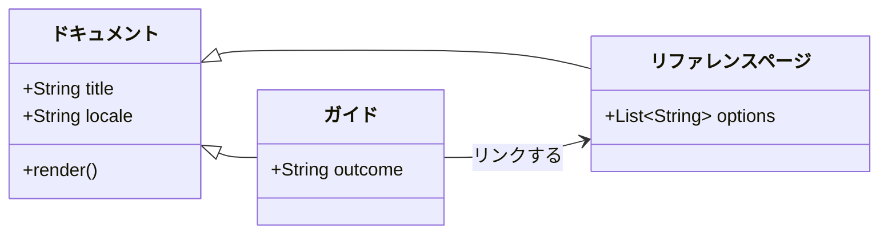

import { Steps, Tabs, TabItem } from '@astrojs/starlight/components';

テーマを変更するときの表示確認に使うページです。プロジェクトのドキュメントでよく使う表現を、意図的に1ページへまとめています。

## 手順をわかりやすく示す

<Steps>

1. パッケージをインストールします。

   ```sh title="ターミナル"
   pnpm add @acme/client
   ```

2. 接続先を明示してクライアントを作成します。

   ```ts title="src/client.ts"
   import { createClient } from '@acme/client';

   export const client = createClient({
     endpoint: 'https://api.example.com',
   });
   ```

3. ヘルスチェックを実行し、アプリケーションとの境界で失敗を処理します。

</Steps>

:::tip[成果から書き始める]
ガイドの冒頭では、読者が何を達成できるかを示します。網羅的なオプション一覧はリファレンスへ分けてください。
:::

## 同じ目的の選択肢

タブは、同じ目的を達成する複数のコマンドから1つを選ぶ場面に適しています。選択したパッケージマネージャーはページを移動しても維持されます。

<Tabs syncKey="package-manager">
  <TabItem label="pnpm" icon="seti:pnpm">
    ```sh
    pnpm add @acme/client
    ```
  </TabItem>
  <TabItem label="npm" icon="seti:npm">
    ```sh
    npm install @acme/client
    ```
  </TabItem>
  <TabItem label="Yarn" icon="seti:yarn">
    ```sh
    yarn add @acme/client
    ```
  </TabItem>
</Tabs>

## ワークフローを図で示す

文章より図のほうが流れや関係を把握しやすい場合は、`flowchart` を使います。すべてのMermaid図は `mermaid` のコードフェンスで記述でき、配色はサイトのカラーテーマへ自動的に追従します。



## やり取りの順序を示す

読者、ブラウザ、ドキュメントサイトの間をリクエストが移動する場合など、メッセージの順序が重要なときは `sequenceDiagram` を使います。



## 型の構造を示す

実装の詳細を含めず、型の重要なメンバーや型同士の関係を示す場合は `classDiagram` を使います。



## モジュールの関係を示す

Mermaidの `architecture-beta` は、モジュールをグループ化し、生成されたコンテンツがどのように移動するかを示せます。要求の細かい順序ではなく、小さなシステムの概要を示す場合に使います。


## コードハイライト

ライトテーマには **Slack Ochin**、ダークテーマには **Tokyo Night** を使用しています。ファイル名、注目行、差分、コピー操作はExpressive Codeが提供します。

```ts title="src/lib/fetch-release.ts" {7-11}
export interface Release {
  version: string;
  publishedAt: string;
}

export async function fetchLatestRelease(): Promise<Release> {
  const response = await fetch('/api/releases/latest');
  if (!response.ok) {
    throw new Error(`Release request failed: ${response.status}`);
  }
  return response.json() as Promise<Release>;
}
```

```diff title="設定の変更"
-const retries = 1;
+const retries = 3;
```

## リファレンス向けのデータ

| オプション | 型 | デフォルト | 用途 |
| --- | --- | --- | --- |
| `endpoint` | `string` | — | すべてのリクエストで使うベースURLです。 |
| `retries` | `number` | `3` | 一時的な失敗を再試行します。 |
| `timeout` | `number` | `5000` | 指定したミリ秒で停止中のリクエストを打ち切ります。 |

:::caution[正確なサンプルを書く]
サンプルコマンドは安全にコピーできる内容にします。プレースホルダー、破壊的な操作、必要な認証情報は明示してください。
:::

## 長い文章の読みやすさ

良いドキュメントでは、すべての文を別々の段落にせず、段落を適度な長さに保ちます。

読みやすい行幅とゆとりある行間は、次の行へ視線を移す負担を減らします。控えめな見出しサイズは、ページを圧迫せずに階層を伝えます。説明に残す情報を選ぶときは、次の方針を基準にします。

> 読者が次の正しい判断をするために十分な背景を、できるだけ短く説明します。

たとえば、インストールガイドでは前提条件、実行するコマンド、成功を確認する方法を順に説明します。使用頻度の低いオプションはリンク先のリファレンスへまとめると、読者は手順を見失わずに作業を終えられます。
